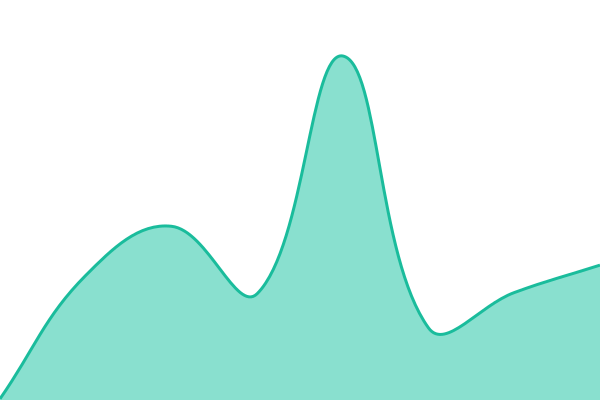
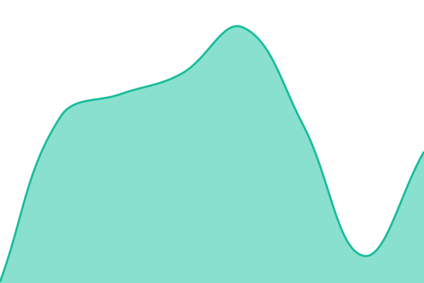
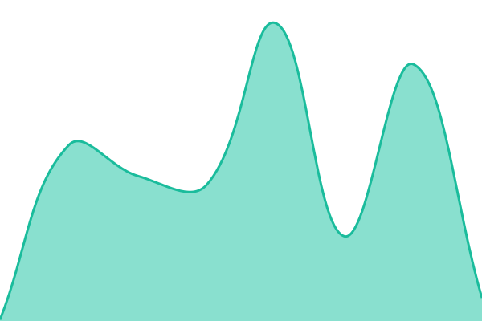
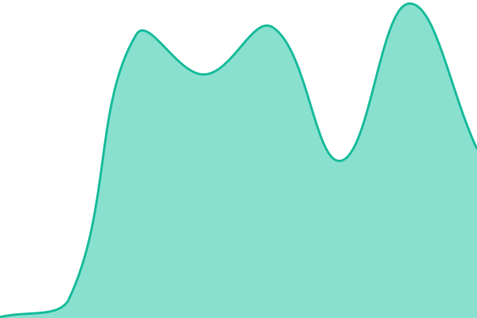
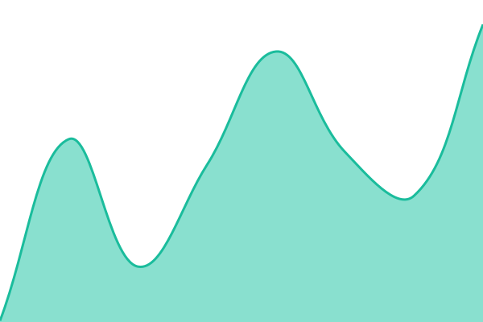
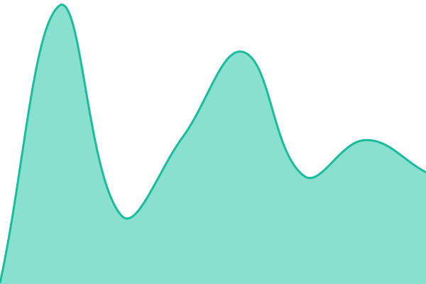

# [📈 Live Status](https://status.crawl4ai.com): <!--live status--> **🟩 All systems operational**

This repository contains the open-source uptime monitor and status page for [UncleCode](http://kidocode.com), powered by [Upptime](https://github.com/upptime/upptime).

With [Upptime](https://upptime.js.org), you can get your own unlimited and free uptime monitor and status page, powered entirely by a GitHub repository. We use [Issues](https://github.com/unclecode/crawl4ai-status/issues) as incident reports, [Actions](https://github.com/unclecode/crawl4ai-status/actions) as uptime monitors, and [Pages](https://status.crawl4ai.com) for the status page.

<!--start: status pages-->
<!-- This summary is generated by Upptime (https://github.com/upptime/upptime) -->
<!-- Do not edit this manually, your changes will be overwritten -->
<!-- prettier-ignore -->
| URL | Status | History | Response Time | Uptime |
| --- | ------ | ------- | ------------- | ------ |
|  [Scrape API](https://gate.crawl4ai.com/health/scrape) | 🟩 Up | [scrape-api.yml](https://github.com/unclecode/crawl4ai-status/commits/HEAD/history/scrape-api.yml) | 

 196ms
     
 | 

<a href="https://status.crawl4ai.com/history/scrape-api">100.00%</a>
    

|  [Search API](https://gate.crawl4ai.com/health/search) | 🟩 Up | [search-api.yml](https://github.com/unclecode/crawl4ai-status/commits/HEAD/history/search-api.yml) | 

 181ms
     
 | 

<a href="https://status.crawl4ai.com/history/search-api">100.00%</a>
    

|  [Extract API](https://gate.crawl4ai.com/health/extract) | 🟩 Up | [extract-api.yml](https://github.com/unclecode/crawl4ai-status/commits/HEAD/history/extract-api.yml) | 

 191ms
     
 | 

<a href="https://status.crawl4ai.com/history/extract-api">100.00%</a>
    

|  [MCP Server](https://gate.crawl4ai.com/health/mcp) | 🟩 Up | [mcp-server.yml](https://github.com/unclecode/crawl4ai-status/commits/HEAD/history/mcp-server.yml) | 

 152ms
     
 | 

<a href="https://status.crawl4ai.com/history/mcp-server">100.00%</a>
    

|  [Website](https://gate.crawl4ai.com/) | 🟩 Up | [website.yml](https://github.com/unclecode/crawl4ai-status/commits/HEAD/history/website.yml) | 

 333ms
     
 | 

<a href="https://status.crawl4ai.com/history/website">100.00%</a>
    

|  [Documentation](https://docs.crawl4ai.com/) | 🟩 Up | [documentation.yml](https://github.com/unclecode/crawl4ai-status/commits/HEAD/history/documentation.yml) | 

 238ms
     
 | 

<a href="https://status.crawl4ai.com/history/documentation">100.00%</a>
    

|  [Crawler Arena](https://arena.crawl4ai.com/) | 🟩 Up | [crawler-arena.yml](https://github.com/unclecode/crawl4ai-status/commits/HEAD/history/crawler-arena.yml) | 

 302ms
     
 | 

<a href="https://status.crawl4ai.com/history/crawler-arena">100.00%</a>
    

<!--end: status pages-->

[**Visit our status website →**](https://status.crawl4ai.com)

## 📄 License

- Powered by: [Upptime](https://github.com/upptime/upptime)
- Code: [MIT](./LICENSE) © [Anand Chowdhary](https://anandchowdhary.com)
- Data in the `./history` directory: [Open Database License](https://opendatacommons.org/licenses/odbl/1-0/)
